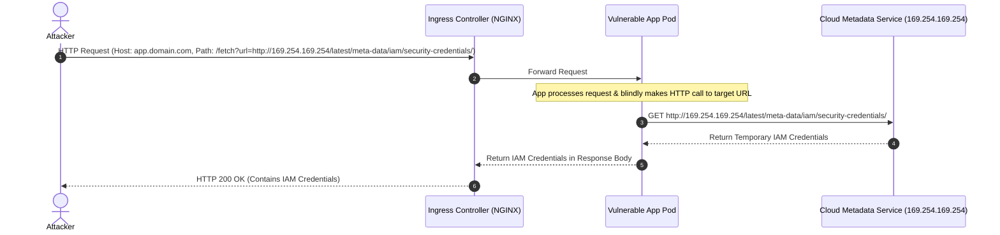

# Mettere in Sicurezza Kubernetes Ingress: Mitigare la Server-Side Request Forgery (SSRF) e la Host Header Injection

Negli ambienti containerizzati, Kubernetes Ingress agisce come punto di ingresso per il traffico esterno HTTP e HTTPS, instradandolo ai servizi interni in base a regole definite. Sebbene Ingress offra robuste capacità di routing, presenta anche una significativa superficie di attacco. Configurazioni non sicure possono esporre il cluster a Server-Side Request Forgery (SSRF) e Host Header Injection, portando potenzialmente alla compromissione totale del cluster o all'esposizione delle credenziali cloud.

## Comprendere l'Architettura di Kubernetes Ingress

Un'architettura Ingress è composta da due componenti principali:
1. **Ingress Controller**: Il demone vero e proprio (come NGINX Ingress, Traefik o Envoy) in esecuzione nel cluster che gestisce il reverse proxying e il bilanciamento del carico. Monitora l'API di Kubernetes per le modifiche alle risorse Ingress e aggiorna dinamicamente la sua configurazione.
2. **Risorsa Ingress**: Un insieme di regole di configurazione che definiscono come il traffico deve essere instradato ai Servizi di backend (ad esempio, instradare `example.com/api` al pod `api-service`).

Il traffico entra nell'Ingress Controller, il quale ispeziona gli header della richiesta HTTP (principalmente l'header `Host` e il percorso della richiesta), li confronta con le risorse Ingress e inoltra la richiesta al Cluster IP del pod di destinazione.

## Server-Side Request Forgery (SSRF) tramite Ingress Controller

La Server-Side Request Forgery si verifica quando un attaccante forza un server (in questo caso, l'Ingress Controller o un servizio interno) a effettuare richieste HTTP a una destinazione arbitraria. 

In un cluster Kubernetes, la SSRF è particolarmente pericolosa perché l'Ingress Controller è situato all'interno della rete del cluster. Un attaccante che sfrutta con successo una vulnerabilità SSRF nell'Ingress Controller (o un'applicazione dietro di esso) può accedere a:
- **Cloud Metadata Service**: L'endpoint dei metadati dell'istanza (`169.254.169.254`) del nodo del provider cloud sottostante che ospita il cluster, che spesso contiene credenziali IAM ad alto privilegio.
- **Kube-Apiserver**: L'API server di Kubernetes, che potrebbe essere raggiungibile a `https://kubernetes.default.svc`.
- **Servizi Interni**: Servizi non pubblici (come database, cache Redis o dashboard di monitoraggio) che non richiedono l'autenticazione perché presumono che la rete interna sia sicura.

Ad esempio, se un Ingress Controller supporta funzionalità di routing dinamico o è configurato in modo errato per instradare il traffico ai backend esterni specificati negli header HTTP, può essere abusato per fare da proxy per le richieste verso endpoint esclusivamente interni.

## Host Header Injection e Route Poisoning

La Host Header Injection sfrutta il modo in cui gli Ingress Controller associano le richieste in arrivo ai servizi di backend. I controller Ingress esaminano l'header `Host` per determinare il servizio di destinazione.

Se l'Ingress Controller non è configurato per convalidare o limitare gli header Host in arrivo, sorgono diversi problemi:
1. **Aggiramento dei Controlli di Accesso**: Un attaccante può inviare una richiesta con un header `Host` falsificato per accedere a pannelli amministrativi o servizi interni che sono esposti sul controller Ingress ma limitati tramite DNS o firewall esterni.
2. **Route Poisoning / Virtual Host Confusion**: Se l'applicazione di backend stessa si basa sull'header `Host` per generare link, reimpostare le password o recuperare le configurazioni, un attaccante può manipolare l'header per iniettare domini malevoli, inducendo l'applicazione a reindirizzare gli utenti legittimi verso siti di phishing o a caricare configurazioni malevole.

## Flusso di Attacco Visualizzato

Il seguente diagramma Mermaid illustra come un attaccante può sfruttare una vulnerabilità SSRF per aggirare i controlli perimetrali ed estrarre le credenziali dal Cloud Metadata Service:



## Mitigare le Vulnerabilità Ingress

Mettere in sicurezza il perimetro Ingress richiede una strategia difensiva multilivello.

### 1. Network Policies (La Barriera Cruciale)
Il modo più efficace per mitigare la SSRF è bloccare il traffico in uscita verso destinazioni sensibili a livello di rete. Le Network Policies di Kubernetes dovrebbero essere definite per limitare il traffico Egress sia dei pod Ingress sia dei pod applicativi.

La seguente NetworkPolicy blocca tutto il traffico in uscita (egress) verso l'IP dei metadati cloud (`169.254.169.254`):

```yaml
apiVersion: networking.k8s.io/v1
kind: NetworkPolicy
metadata:
  name: block-metadata-egress
  namespace: production
spec:
  podSelector: {}
  policyTypes:
  - Egress
  egress:
  - to:
    - ipBlock:
        cidr: 0.0.0.0/0
        except:
        - 169.254.169.254/32
```

### 2. Rafforzare le Configurazioni dell'Ingress Controller
- **Disabilitare il Routing Dinamico del Backend**: Disabilitare le configurazioni che consentono il routing basato sugli header della richiesta.
- **Validazione Rigorosa dell'Host**: Configurare l'Ingress Controller per scartare le richieste che non corrispondono a un elenco predefinito di host validi. In NGINX Ingress, questo si ottiene abilitando la corrispondenza rigorosa dei nomi dei server.
- **Sanitizzazione degli Header**: Rimuovere o sanificare gli header del proxy (come `X-Forwarded-Host` e `X-Forwarded-For`) al perimetro per prevenire la confusione degli host a valle.

### 3. Mitigazioni a Livello di Applicazione
Assicurarsi che qualsiasi applicazione che gestisce le richieste di URL convalidi l'input rispetto a una whitelist rigorosa di domini e protocolli consentiti (ad esempio, consentendo solo `https://` e rifiutando gli indirizzi IP o i nomi di dominio interni come `.local` o `.svc.cluster.local`).


## Collegamenti
- [[Kubernetes Security (RBAC, escape)]]
- [[Server-Side Request Forgery (SSRF)]]
- [[SSRF e Metadata Service (IMDS)]]
- [[Container Security (Docker)]]

## Fonti
- Kubernetes — Ingress: https://kubernetes.io/docs/concepts/services-networking/ingress/
- OWASP — SSRF Prevention Cheat Sheet: https://cheatsheetseries.owasp.org/cheatsheets/Server_Side_Request_Forgery_Prevention_Cheat_Sheet.html
- NGINX Ingress Controller — Security: https://kubernetes.github.io/ingress-nginx/
